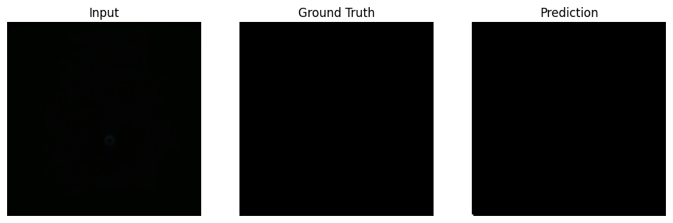

U-Net MRI Segmentation

This project implements a U-Net architecture in PyTorch to segment brain structures in MRI images. It includes preprocessing, model training, evaluation, and visualization of the segmented outputs.

Features
- U-Net implementation in PyTorch
- Dice Loss for segmentation accuracy
- GPU support (optional but recommended)
- Visual comparison of original vs predicted masks

Dataset
The dataset consists of brain MRI images and corresponding segmentation masks. You can use any public brain MRI dataset or replace the `data/` folder with your own.

How to Run
1. Install requirements:
    ```bash
    pip install -r requirements.txt
    ```
2. Open the notebook:
    ```bash
    jupyter notebook Copy_of_unet_mri_segmentation.ipynb
    ```
3. Run all cells to train and visualize results.

Note: Training on CPU is slow. I used a GPU to speed up the process!

Sample Results:
Results are below which include the Input MRI, Ground Truth, and Predicted Mask for 3 sets of MRIs

*Set 1:*


*Set 2:*  


*Set 3:*  


Folder Structure
```
unet-mri-segmentation/
├── Copy_of_unet_mri_segmentation.ipynb
├── requirements.txt
├── README.md
├── results/
│   ├── output_1.png
│   ├── output_2.png
│   └── output_3.png
└── data/
    └── (include your training data here)
```

License
MIT License
